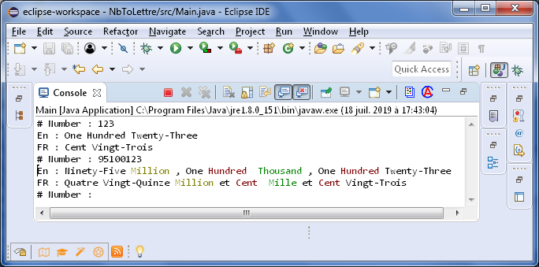

# Generate
This is simple java console based app <br />
that take as input Long number and <br />
GENERATE suite of lettre 


## Hint
----
* input must be in this intervalle : [0, Long.MAX_VALUE]
* Generate into three languages Arabic, English, Frensh and Indian coming soon
* You can switch ON/OFF colored output from ToggleColor() [Console Only]
* Use the build tool [Maven](https://maven.apache.org/) to build, install and package
* Base on other [repo](https://github.com/elhoussam/numbreTolettre) and Comes with simple GUI



## Project Structure
<b> mvn.generator </b> : all the magic is happen inside this folder which make it the CORE of the App <br/> 
to use it here as lib or dependencie to user with any other app, in order to make that possible we use <B>MAVEN</B>  <br/>
we should install the CORE into local repository {$USER_HOME/.m2/repository} by typing the following CMD :
```git
mvn install
```
<b> gui </b> : simple Graphic User interface using javafx libs to make this make usable for any user.
<b> <i>Info</i> </b> each folder contain target folder which has all the generated file (classes, jars, src folders) by using 
the following CMD : 
```git
mvn install
```
 

## User Interface
--------------


all this screen shot from the GUI 
## Contributing
--------------
Pull requests are welcome. For major changes.

## License
-----------
GPLv3
